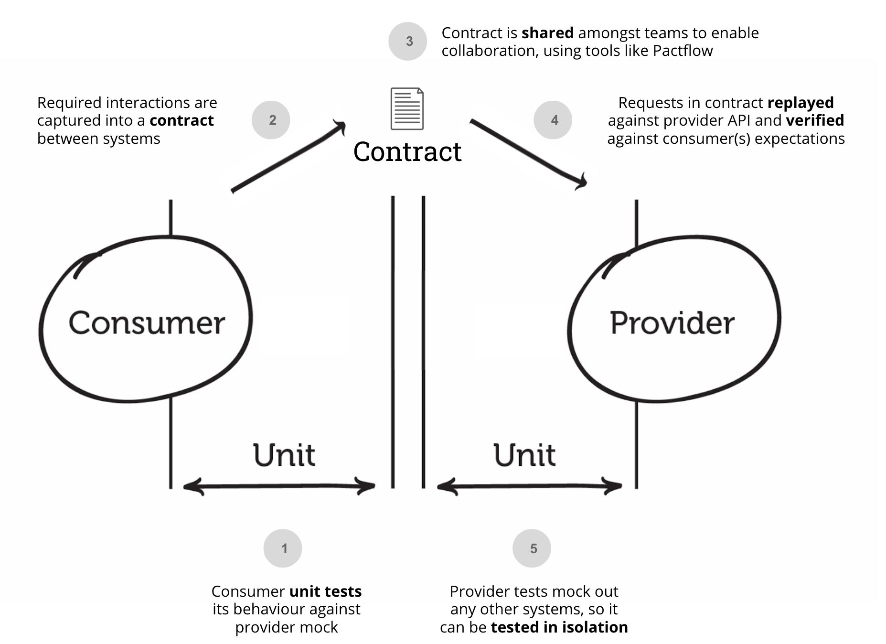
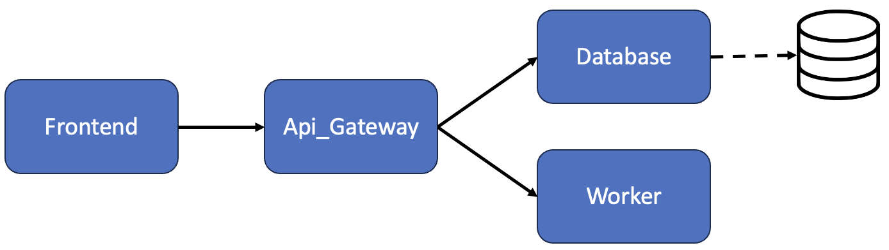

# Pact Python Demo
Used this repo as a sandbox to explore [Pact for Python](https://github.com/pact-foundation/pact-python). Goal was to figure out if it was suitable & beneficial to integrate this type of testing into my team's CI/CD pipeline. Now it serves as an introductory demo.

### What is contract testing?
"***Contract testing** is a technique for testing an integration point by checking each application in isolation to ensure the messages it sends or receives conform to a shared understanding that is documented in a "contract".*

For applications that communicate via HTTP, these "messages" would be the HTTP request and response, and for an application that used queues, this would be the message that goes on the queue.

In practice, a common way of implementing contract tests (and the way Pact does it) is to check that all the calls to your test doubles [return the same results](https://martinfowler.com/bliki/ContractTest.html) as a call to the real application would." - Quoted from [Pact's official website](https://docs.pact.io/#what-is-contract-testing).

### Infograph on contract testing:


# Information
### Overview of microservices this demo contains


(_Note that this demo does not connect to an actual database, the database clipart in the diagram just signifies where one would be connected to_)

### Frontend
1. Endpoint receives a name which will be sent as a request to **Api_Gateway**, which is supposed to respond with its corresponding number cube-squared
    - If the endpoint receives a name 'bob' which corresponds to '3' in the database, it should return 3^3^2 which is 729

### Api_Gateway
1. Receives a name from **Frontend** which will be sent as a request to **Database**, responding with its corresponding number
1. The response number will be sent as a request to **Worker** to be cubed
1. The response cubed number will be sent as a request to **Worker** to be squared
1. The response cubed then squared number will be returned as a response back to **Frontend**

### Database
1. Receives a name from **Api_Gateway** which will return with the name's corresponding number if available
    - If the database is `{"bob": 3}` and it receives a request of "bob", it will return a response of "3"

### Worker
1. Receives a number from **Api_Gateway** and depending on the endpoint called, it will either:
    - Return a response of the number squared
    - Return a response of the number cubed

### Other info
Each of the services will be hosted on [Uvicorn](https://www.uvicorn.org/) and are designed to communicate via [FastAPI](https://fastapi.tiangolo.com/lo/).

The Pact broker [server](https://github.com/pact-foundation/pact-python/blob/master/examples/broker/docker-compose.yml)(*if utilized*) will be in a dockerized container.å

# Setup
## Prerequisites:
- Python v3.11 (_some minor versions below may work, but they weren't tested_) for [direct testing](#direct-testing)
- [Docker engine](https://docs.docker.com/engine/install/) for testing on [docker containers](#docker-test-containers)

## Environment setup:
### Direct testing
- To run the tests directly on your machine, you would need to first install the required python packages:
    ```
    $ pip install -r requirements-dev.txt
    ```

### Docker test containers
- To run the tests via prepared docker containers, first ensure you have the [docker engine](#prerequisites) up and running

### Pact broker server
- If simulating with a broker is desired, ensure [docker engine](#prerequisites) is up and running. Then enter the 'broker' directory and run:
    ```
    $ docker-compose up
    ```
    This will pull and run the broker service in docker containers

# Usage
## Running tests directly
1. Running pact test on a service:
    
    By default, pact contracts will be handled locally in the 'pacts' directory. This directory will automatically be created in the 'contract' directory once you have run a test that includes consumer testing.

    To run the pact tests (*both consumer & provider if available*) on an individual service, run its testing script:
    ```
    $ ./tests/contract/pact_test_{x}.sh
    ```
    (_replace `{x}` with service name_)

    If the script files cannot be found/accessed, ensure you have permissions to execute it by running:
    ```
    $ chmod +x tests/contract/pact_test_{x}.sh
    ```
    (_replace `{x}` with service name_)

1. The results of the consumer test will be output to the terminal. To see the generated contracts, you may check the 'pacts' directory or the pact broker server(_accessible via web browser_) to see the created contract(s). The contract file should look something like `{consumer}-{provider}.json`

1. The results of the provider verification will be output to the terminal. If published to the pact broker server, it will now show the new verification status of the contract(_as seen when accessing via web browser_).

## Running tests using docker containers
1. Selecting the service to test

    You may change the `SERVICE` constant in `docker_pact.sh` to any one of the services in 'src' by name (*excluding the file extension '.py'*)

1. Run the docker test container script

    Simply run the script to start the testing process:
    ```
    $ ./tests/docker_pact.sh
    ```

    If the script files cannot be found/accessed, ensure you have permissions to execute it by running:
    ```
    $ chmod +x tests/docker_pact.sh
    ```

1. The results of the consumer test will be output to the terminal. To see the generated contracts, you may check the 'pacts' directory or the pact broker server(_accessible via web browser_) to see the created contract(s). The contract file should look something like `{consumer}-{provider}.json`

1. The results of the provider verification will be output to the terminal. If published to the pact broker server, it will now show the new verification status of the contract(_as seen when accessing via web browser_)

1. The docker logs will be saved at the end of the testing process. It will be saved in 'tests/contract/log' as `pact-docker.log`

## Using pact broker server to handle your contracts
By default, the pact contracts will be stored locally in the 'tests/contract/pacts' folder. If you wish to use the pact broker server to handle your pact contracts for you, make these changes before running any script to allow it to communicate with the broker server:

- Make sure the broker service is already set up as shown in the environment setup [section](#pact-broker-server)

- When testing a service **{x}** as a consumer, you may change the `PACT_BROKER_PUBLISH` constant in `test_{x}-{y}.py` to True/False whether you want to publish it to your broker server.

- When verifying service **{x}** as a provider, you may add a provider version as an argument of the script (_e.g. `./tests/contract/pact_test_{x}.sh 1.0.0`_) which will verify the latest contract using **pact broker** instead of the local contract.
